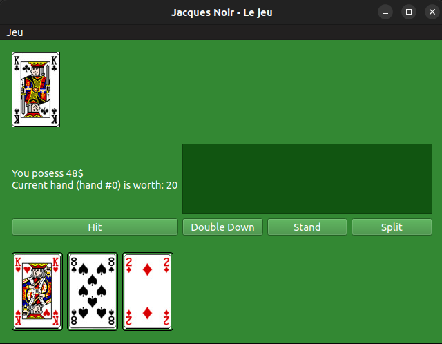
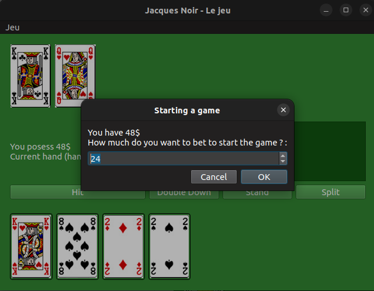
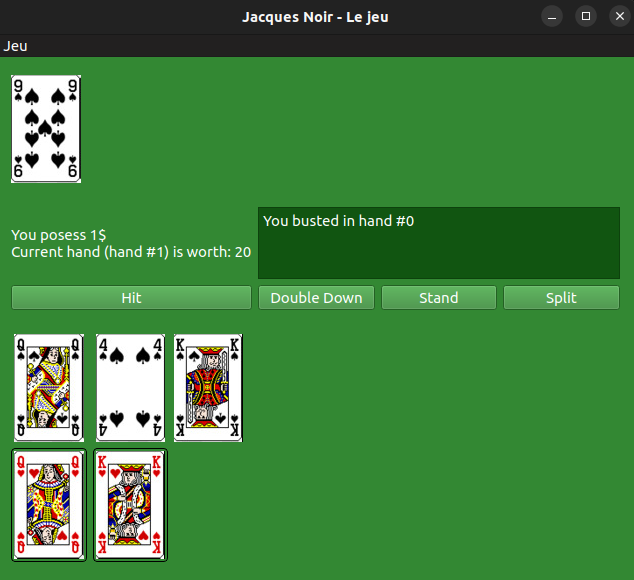

# JacquesNoir

This is a full implementation of the Blackjack game using C++ and Qt5

## Building

There is ".pro" file used for building the project using qmake

## Structure

The code is split in two sections, the game logic kernel and the GUI.
The game logic kernel can be used independently of the GUI. There is a "display" function in `blackjack.cpp` used to implement a Command-line version.
The GUI uses Qt5 and is quite straight-forward. There are images in the "assets" folder used for displaying cards or emojis.

There is a simplistic Command-line implementation in BJCommandLineImplementation.cpp.

Mind that this is an old and abandonned project.

## Screenshots

\
\
In rare cases, if the player receives two cards of the same number, he can split his hand and double his bet to win more.\

